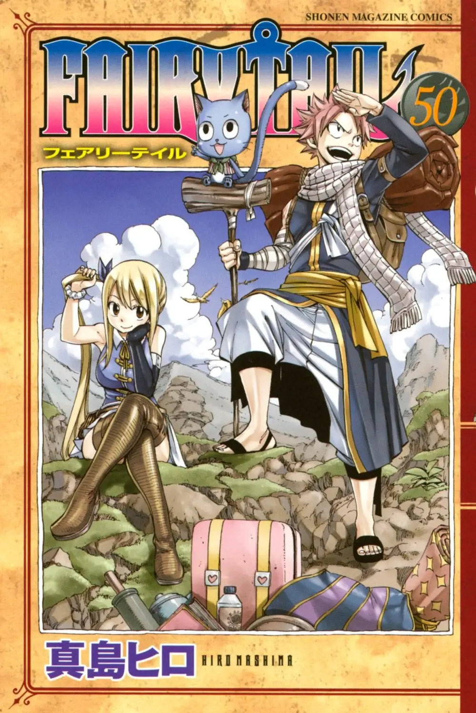
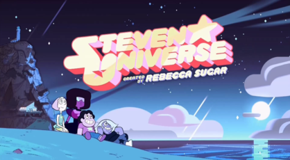
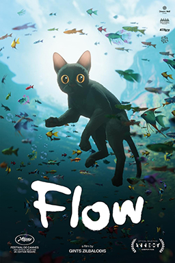

# Sarah Balatbat

_**CSE 110 Software Engineering | UC San Diego**_


**Contents**
- [Sarah Balatbat](#sarah-balatbat)
  - [About Me](#about-me)
    - [Favorite Shows](#favorite-shows)
    - [Favorite Films](#favorite-films)
  - [Relevant Links](#relevant-links)

## About Me

Hi, my name is Sarah, I'm a 3rd Year Computer Science major in UCSD. Here are some of my interests in computing:

* Web stack development with HTML/CSS/JS
* UI / UX Design
* C/C++ Programming

I'm undecided on career aspirations but it would be awesome if I can get into something like UI/UX, video game development, or app/web development.

Outside of CS, I love making visual art in both digital media (Krita, Microsoft Paint, PhotoPea, etc) and traditional media (pencil, acrylic paint). A few of my favorites:


.png)

I also like playing guitar and singing, playing cozy video games, and naps in a hammock under the sun. I love cats *a lot* ~~nearly everyone who knows me can tell you this~~. There's also quite a lot of works of art that I enjoy. Below are some lists of my favorite works in various media:

### Favorite Shows
1. [*Haikyu!!*](https://en.wikipedia.org/wiki/Haikyu!!)
   
  > 
2. [*Fairy Tail*](https://en.wikipedia.org/wiki/Fairy_Tail)
   
  > 
3. [*Steven Universe*](https://en.wikipedia.org/wiki/Steven_Universe)

  > 
4. [*Hi My Sweetheart*](https://en.wikipedia.org/wiki/Hi_My_Sweetheart)

  > 

### Favorite Films
1. [*Spider-Man: Into the Spiderverse*](https://en.wikipedia.org/wiki/Spider-Man:_Into_the_Spider-Verse)

  > 
2. [*3 Idiots*](https://en.wikipedia.org/wiki/3_Idiots)

  > 
3. [*Flow*](https://en.wikipedia.org/wiki/Flow_(2024_film))

  > 
4. [*Eternal Sunshine of the Spotless Mind*](https://en.wikipedia.org/wiki/Eternal_Sunshine_of_the_Spotless_Mind)

  > 

## Relevant Links
[<ins>LinkedIn</ins>](https://www.linkedin.com/in/sarah-claire-balatbat-456343249/) | [<ins>GitHub</ins>](https://github.com/sbalatbat) | [<ins>My Art</ins>](https://www.instagram.com/incog9to/)

```"Do not kill the part of you that is cringe. Kill the part that cringes."```

[ ] Read this page

[ ] Check out my art maybe... 👉👈