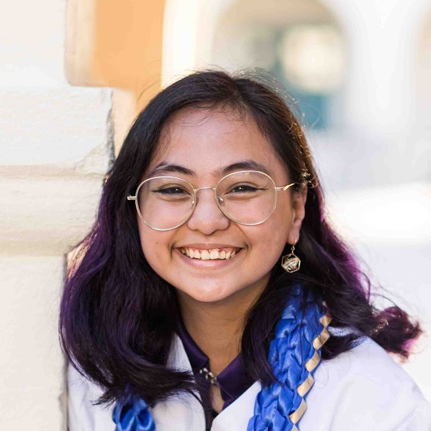

# Sarah Balatbat

> _**CSE 110 Software Engineering | UC San Diego**_

**Contents**
- [Sarah Balatbat](#sarah-balatbat)
  - [About Me](#about-me)
  - [Relevant Links](#relevant-links)

## About Me

Hi, my name is Sarah, I'm a 3rd Year Computer Science major in UCSD. Here are some of my interests in computing:

* Web stack development with HTML/CSS/JS
* UI / UX Design
* C/C++ Programming

I'm undecided on career aspirations but it would be awesome if I can get into something like UI/UX, video game development, or app/web development.

Outside of CS, I love making visual art in both digital media (Krita, Microsoft Paint, PhotoPea, etc) and traditional media (pencil, acrylic paint). A few of my favorites:

.png)

I also like playing guitar and singing, playing cozy video games, and naps in a hammock under the sun. I love cats *a lot* ~~nearly everyone who knows me can tell you this~~.

## Relevant Links
[<ins>LinkedIn</ins>](https://www.linkedin.com/in/sarah-claire-balatbat-456343249/) | [<ins>GitHub</ins>](https://github.com/sbalatbat) | [<ins>My Art</ins>](https://www.instagram.com/incog9to/)