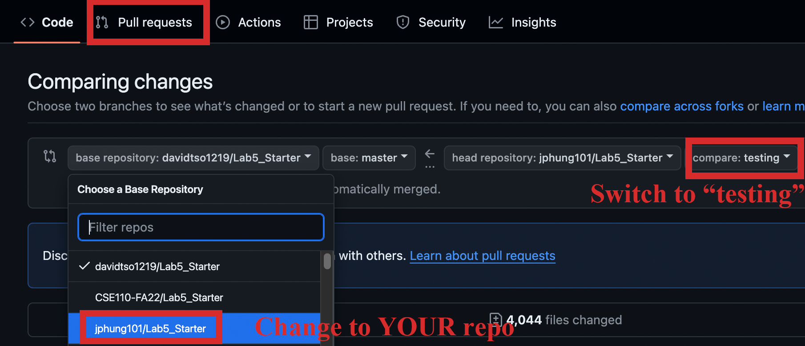
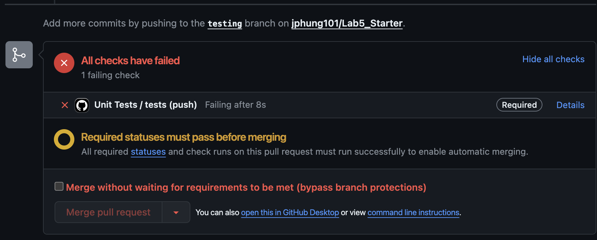

# Lab Week 5 - JavaScript DOM Basics and GitHub Actions

The previous lab had you learn the basics of JavaScript as a programming language, but as we know, JavaScript does not live in an isolated environment. In this week’s lab we are going to dive into how JavaScript intersects with HTML in what is referred to as the  DOM (Document Object Model). With this knowledge we’ll finally be able to add some interactivity to our websites! Then we’ll briefly touch on GitHub actions, a topic that should directly aid you in your projects. 

For this lab, it will be important that you have a general idea of what the DOM (Document Object Model) is and how it operates. On a basic level it is an object-oriented abstraction that the browser builds from the HTML that allows you to interact with the document programmatically, but you can read up more about an introduction to the DOM here()

# Resources
- Audio Element: https://developer.mozilla.org/en-US/docs/Web/HTML/Element/audio
- Audio Element Volume: https://www.w3schools.com/tags/av_prop_volume.asp
- Get Element by ID: https://developer.mozilla.org/en-US/docs/Web/API/Document/getElementById
- Creating a DOM Tree: https://developer.mozilla.org/en-US/docs/Web/API/Document_object_model/How_to_create_a_DOM_tree
- Range Input Element: https://developer.mozilla.org/en-US/docs/Web/HTML/Element/input/range
- Dom Event Listeners: https://www.w3schools.com/js/js_htmldom_eventlistener.asp
- Radio Input Element: https://developer.mozilla.org/en-US/docs/Web/HTML/Element/input/radio
- GitHub Actions: https://docs.github.com/en/actions/learn-github-actions/introduction-to-github-actions
- GitHub Actions Example : https://docs.github.com/en/actions/learn-github-actions/understanding-github-actions#create-an-example-workflow
- Jest Supports ES6 syntax natively: https://stackoverflow.com/questions/35756479/does-jest-support-es6-import-export
 

# Set Up
1. [Fork](https://docs.github.com/en/github/getting-started-with-github/fork-a-repo) the Lab5: https://github.com/CSE110-SP25/Lab5_Starter
2. Clone your forked repository to your local machine.
3. In your **README.md** add your name and the names of your lab partner(s). See the **Lab 5 Logistics** section above on restrictions regarding choosing your lab partners.
4. Run this terminal command
```
npm -v
```
(checks if you have the Node Package Manager aka **npm** installed -- this is a tool that allows you to access and download resources such as external library code written by other people in the form of software packages that npm locates within a giant registry)
- If you don’t have it on your local machine, install it here https://www.npmjs.com/get-npm
5. Run this command:
```
npm install --save-dev jest
```
This installs Jest, the Javascript testing framework we’ll be using
- Note: “--save-dev” includes these packages only during development. Since puppeteer and jest are just for testing, there’s no need to include the extra dependencies when you deploy for projects for production
6. Add the new **node_modules** directory to your **.gitignore** inside your top-level directory to prevent code bloat committed to your repository.
If the installation does not automatically produce a **package.json** file for you, you can create a blank one and fill it out with the data in the section below

# Configuring Jest
- First, configure your npm script to run Jest. In your package.json, add a scripts section with the following:
```
"scripts": {
    "test": "node --experimental-vm-modules node_modules/jest/bin/jest.js"
}
```
This will tell your node interpreter to run the "jest" command when we run "npm run test"
- Configure your node project
  - Inside of your **package.json** file, inside the JSON object at the top level (e.g. right before the last curly brace ‘}’), add the following in order to prevent Jest from trying to transform ESM code to CommonJS and show with verbose output
```
"jest": {
  "transform": {},
  "verbose": true
}
```
Lastly, copy the following snippet to your **package.json** so jest can understand Javascript in ES6 syntax
```
"type": "module"
```
your **package.json** file should end up like this:
```
{
  "devDependencies": {
    "jest": "^29.7.0"
  },
  "scripts": {
    "test": "node --experimental-vm-modules node_modules/jest/bin/jest.js"
  },
  "type": "module",
  "jest": {
    "transform": {},
    "verbose": true
  }
}
```

# Expose - Party Horn (5 points)
Example Video:

<video src="/media/horn-demo.mp4" width="312" height="180" controls></video>

## Instructions
For this part of the lab, you will be implementing a “Party Horn” - a small application that will display a photo and let you play a sound for the party horn that you select. Luckily for you, all of the static HTML, CSS, and Assets have already been created and can be accessed from the [starter code](https://github.com/CSE110-SP25/Lab5_Starter). It is up to you to implement the functionality that we’ve specified below using JavaScript. You can fork our repo or clone it and set up one of your own manually.

Some Ground Rules:

- Do **NOT** modify any of the HTML/CSS files we give you, the lab is entirely possible to be completed without doing so
- You **MUST** use only vanilla JavaScript, no libraries (that we haven’t included for you) allowed
- **ALL** of your JavaScript must be placed within the **expose.js** and **explore.j**s files in **assets/scripts**
 

## Introduction
For Lab5 part 1 we are introducing some basic browser APIs to help you get comfortable with using JavaScript to modify your HTML document based on user actions. Every web browser provides developers with the same standard core of APIs which you will be working with here. The main three we will focus on in this lab are **document selectors, event listeners,** and **canvas**.

### Document selectors:

Your web browsers offer you the global **document** object so that you can interact with your HTML using javascript. Think of it as the translator between your javascript and HTML, allowing you to read the properties of your HTML elements and update them with JavaScript code. The most common way to interact with your HTML document is through document selectors that allow you to access your HTML elements as JavaScript objects. Here are a few functions that you would find helpful for this lab. 

- [document.getElementById(“id-of-your-element”)](https://developer.mozilla.org/en-US/docs/Web/API/Document/getElementById)
  - Returns an html element reference that contains an id attribute that matches the string you passed in
- [document.getElementsByClassName(“class-of-your-elements”)](https://developer.mozilla.org/en-US/docs/Web/API/Document/getElementsByClassName)
  - Returns a list of element references where each element contains a class attribute that matches the string passed in 
- [document.querySelector("css-selector")](https://developer.mozilla.org/en-US/docs/Web/API/Document/querySelector)
  - A very powerful way to use this is to use the attribute selector you used in the CSS lab "['attributeName'='attributeValue']".
  - EX) document.querySelector("[type='radio']") will select an element like <input type="radio"/>
  - A pretty diverse selector that selects an element in the same way that you select an element in css. For example passing in "#cool-thing" will select an element with the id "cool-thing".

These are obviously not the only ways to select elements in JavaScript, so if you feel more comfortable using a different syntax you are welcome to. However the functions listed here will take care of everything you need to complete this lab. 

** a helpful tip for document selectors is using **console.log()** to view what was returned by your document selection. These selectors will usually return **null** (instead of an error) when the selector can’t find a matching element, so make sure to check just in case. In addition to that you can also view the properties of that element in order to determine which fields you should be reading and editing. If you look carefully at the object properties can you find anything similar between an element’s JS properties and its HTML definition? **

 

### Event Listeners

Like many other programming languages, JavaScript uses event listeners to conditionally run code based on system events and user actions. In order to define an event listener, you must bind it to an HTML element that is present in your markup. There are a variety of different event listeners that vary from element to element so utilize the documentation we provided via links to help you out. The common syntax for general event handling is as follows:

```
htmlElement.addEventListener(‘event type’, function() {

  // code to run when the event is triggered

})
``` 
Obviously there are other ways to define events and you are free to use them if you are comfortable with other syntaxes. However the one listed here will take care of everything you need to complete this lab. 

There are a wide variety of event types that listen for different events. Some that you might find helpful for this lab are:

- [‘input’](https://developer.mozilla.org/en-US/docs/Web/API/HTMLElement/input_event)
- [‘click’](https://developer.mozilla.org/en-US/docs/Web/API/Element/click_event)
- [‘load’](https://developer.mozilla.org/en-US/docs/Web/API/Canvas_API/Tutorial/Using_images#creating_an_image_from_scratch)
- [‘change’](https://developer.mozilla.org/en-US/docs/Web/API/HTMLElement/change_event)
 

## Implementation
*You may notice an “**init()**” function in your JS files - this is an initialize function. It isn’t called until the whole DOM has been parsed, so it’s a good idea to have your functions / element queries stem from this init() function, otherwise you run the risk of trying to query an element that hasn’t loaded yet.*

Requirements:
- When you select a horn from the drop down menu, the following should occur:
  - The correct image should display
  - The correct audio sound file should be set
- When you change the volume on the slider, the following should occur:
  - At zero volume, the mute icon (level 0) should be displayed
  - From 1 to < 33 volume the volume level one svg should be displayed
  - From 33 to < 67 volume the volume level two svg should be displayed
  - From 67 and up the volume level three svg should be displayed
  - The corresponding volume should be set for the audio element (note: this element’s volume is not out of 100)
    - **Hint:** the volume slider's range is from 0 - 100, but the audio element has a [different property](https://developer.mozilla.org/en-US/docs/Web/API/HTMLMediaElement/volume). 
- When you click the “Play Sound” button the following should occur:
  - The corresponding sound for the horn selected should play out loud at the specified volume
  - If the Party Horn is selected, confetti should shoot out when the play button is clicked, as shown in the video
    - A library has been included for you to accomplish this, more on how to use it here https://github.com/loonywizard/js-confetti
    - **Do not run the installation steps**, or include the import statement as we have already installed and imported the confetti library for you 
Once you are done, please publish your explose.html on GitHub pages. 

 

## ⚠️Checkpoint⚠️
Before moving on to the next section, take time to check that your implementation does the following:
- Does your volume slider actually change the volume of the audio? One common mistake is that the volume level icon changes but the actual volume being played does not.
- Also check if your volume slider updates the volume level picture in real time and not just when you land on that volume. Look at the sample video for example.
 

# Explore (5 points)

## Pt 1. Speech Synthesis
Example Video 

<video src="/media/speech-synthesis-demo.mp4" width="312" height="180" controls></video>


For the first part of Explore for this lab, we will be checking out the [SpeechSynthesis](https://developer.mozilla.org/en-US/docs/Web/API/SpeechSynthesis) interface of the Web Speech API. We will be making our smiling faced friend on the **explore.html** page talk to us.

### Implementation
Requirements:
- On page load, all of the available voices that you can use for your SpeechSynthesizer should be loaded and populate the “Select Voice” dropdown. (These are browser specific, so you might get different ones browser to browser).
- When you click the “Press to Talk” button, the following should happen:
  - The text that you have typed into the “Text to speak here” textarea should be spoken out loud using the voice that you have selected
- *Only while the synthesizer is speaking, the face should swap to being open mouthed (included in the images folder)*

## Pt 2. GitHub Actions

### Introduction to Actions

GitHub offers so many different features for building and managing your codebase. However, as we've seen in previous labs, working with GitHub can get pretty tedious and repetitive, especially when you have many branches, issues, pull requests (PRs), etc. This is where GitHub Actions come in handy. 

GitHub Actions allows you to automate specific GitHub tasks when something happens to your repository. It’s helpful to think of GitHub actions as event listeners, but for your GitHub repository. Events like adding a PR, pushing code, and creating issues can trigger specific processes that makes working with a large GitHub codebase a breeze. 🌬 

### Instructions

Follow this link [Understanding GitHub Actions - GitHub Docs](https://docs.github.com/en/actions/learn-github-actions/understanding-github-actions#create-an-example-workflow), to see an example of a GitHub Actions workflow.

## Pt 3. Unit Testing with Jest
The next style we are going to look at you might be more familiar with already: Unit testing. Unit testing involves testing individual parts of your code in encapsulated units to make sure each part of your code is functioning as it should. 

Pros: 
- Debugging on a small scale without many moving parts is much easier than inside of a large moving application. 
- Execute quickly
- Changing other app features likely won’t affect the non-related unit tests

Cons: 
- Cannot test how these individual components interact with each other on an application/feature level. 
 

## Check Your Understanding
Fill in your answers in your **README.md**

1) Would you use a unit test to test the “message” feature of a messaging application? Why or why not? For this question, assume the “message” feature allows a user to write and send a message to another user.

2) Would you use a unit test to test the “max message length” feature of a messaging application? Why or why not? For this question, assume the “max message length” feature prevents the user from typing more than 80 characters.

 

Testing with Jest
To run the tests, run the command `npm test  ./__tests__/sum.test.js` from your top-level directory. It should pass right now since we outlined a basic function for you in sum.test.js

In the `__tests__` directory, open the **sum.test.js** file. Modify the existing test in sum.test.js file to the following:
```
test('adds 1 + 2 to equal 3', () => {
    expect(1 + 2).toBe(3);
});
```
Here, the **test()** function takes in 2 arguments: first, a short description of the test; second, a function of what the test should run. This test used **expect** and **toBe** to test that two values were exactly identical. To learn about the other things that Jest can test: https://jestjs.io/docs/en/using-matchers.

Run:
```
npm test ./__tests__/sum.test.js
```
There should still be 1 passed test now.

We can also add unit tests to test out a function in our program. In `/code-to-unit-test`, there is a `sum.js` file containing a simple function that adds two numbers. In `sum.test.js`:

You can import functions from other files that you want to test. For example, we can import the **sum()** function from sum.js like this:
```
import { sum } from '../code-to-unit-test/sum';
```
Now, we can write *another* test calling the **sum()** function to test its output:
```
test('adds 1 + 2 to equal 3', () => {
    expect(sum(1,2)).toBe(3);
});
```
Run
```
npm test ./__tests__/sum.test.js
```
There should be 2 passed tests!

## Your Turn
Now, just like in **sum.test.js**, you are going to be creating tests in **unit.test.js**. You will notice that we have required a variable **functions** from **unit-test-me.js**. You can access all of the functions from **unit-test-me.js** using this variable by doing something like **functions.isPhoneNumber()**. You will be creating unit tests for each of the functions within **code-to-unit-test/unit-test-me.js** in the file **unit.test.js**

- Run your tests using
```
npm test ./__tests__/unit.test.js
```
- Create **2** tests that should be **true**, and **2** tests that should be **false** for *__each function__ (4 tests x 5 functions = 20 tests)*.
  - For clarification, all of your tests should **pass**, but you should **expect** two of your tests to return a **true** response and two of your tests to return a **false** response
    - e.g. expect(2+2).toBe(4) and expect(4+4).toBe(10)
 

## Putting it All Together: Testing + Github Actions!
Now given all of that, let's try to automate these types of testing.

To do so:

- On your repo and in the master branch, select "Actions" on the top bar:

- Select "set up a workflow yourself ->":

- This should have created a file called "main.yml" found in ".github/workflows/main.yml". Paste the following lines here and commit the changes:
```
name: Unit Tests # name of the test

on: [push] # the Github Action will activate "on" the event that you "push" to the repo

jobs: # the things being executed
  tests: # the name of your status check, will become important when you do branch protection
    runs-on: ubuntu-latest # which device on Github's server that you are running the Actions on
    steps:
      - uses: actions/checkout@v4 # using version 4 of Actions
      - name: Install Dependencies
        run: npm install
      - name: Unit Test
        run: npm test ./__tests__/sum.test.js # the actual testing line
```
- **Now you have set up Github Actions for automated testing! But, we should test that:**
- Create a new branch called "testing"
  - You can do so with:
```
git checkout -b testing 
```
- In your "sum.test.js" file, change the `toBe` parameter so that it is incorrect (e.g. 4)
- Save the file
- Commit the branch with something like this:
  ```
  git commit -am  "testing branch: should be wrong"
  ```
  - You can use a different commit message (the stuff in the quotations)
- Push to the repo
  - *"git push"* should not work on the first push (if it does: weird, but great!), so you should try: *"git push --set-upstream origin testing"*
  - After this initial push, "git push" will work fine 
- **Now we have our invalid "testing" branch semi-ready to merge and create a Pull Request, but let's protect our master branch first!**
- In your repo, go to "Settings" then "Branches":

- Click "Add branch protection rule"
- On "Branch name pattern" enter "master" as we want to protect the "master" branch
- Check "Require status checks to pass before merging" (the second option)
- Under the search bar, type "tests" as that is the name of the status check that we wrote
- Scroll down and hit "Create"
- **Done (sike, not really)**
- **<ins>Let's finally create a Pull Request (PR) to test it:</ins>**
- In your repo, hit "Pull requests" and change the "base repository" TO YOUR REPO, NOT THE ONE YOU FORKED FROM!!! Also, make the "compare" branch our "testing" branch:


- Create the PR and the next page should contain the fact that you cannot merge as there is an error in your Unit Tests: TAKE A SCREENSHOT OF THE ENTIRE PAGE AT THIS POINT (name it "myError.[whatever extension]")


- To fix this:
  - Fix the error in "sum.test.js" (hint: change to `toBe` parameter back to 3)
  - Commit the changes with " git commit -am "[Insert message]" "
  - Push it: "git push"
  - Create the PR (PLEASE, PLEASE DON'T FORGET TO CHANGE THE BASE REPO AND THE COMPARE BRANCH)
  - Voila!
  - TAKE A SCREENSHOT OF THE SUCCESSFUL MERGE AND NAME IT "merged.[whatever extension]"
- Try to setup automated testing for "unit.test.js"!
  - Hint: Add the following line to the `main.yml` file:
```
run: npm test ./__tests__/unit.test.js
```

# Expand - No points
Answer the following questions to the best of your abilities, please write complete answers with adequate detail. Put these in a file titled expand.md and place it in the root of your repo.

1. Why is it important to put thought into your IDs & Classes when it comes to technology intersections? (e.g. how HTML, CSS, and JS intersect)
2. What are Data attributes? Why might they be useful? How do you access them? What are the implications of using Data attributes when it comes to things like microdata?
3. What is a DOM fragment? Why are they powerful?
4. What is the point of a “Virtual DOM”? What do you gain? What do you lose?
5. In JavaScript, usually you can reference every attribute of an element with a dot selector followed by the attribute name, except for the class attribute, which is className. Why is this so?
6. What is the difference between using addEventListener() and something like onClick() ? What are the advantages / disadvantages of both?
 

# Gradescope Submission:
Note: Before turning in your submission, please **enable GitHub pages** for your repo so that we can test your code. Instructions for where to include the link to that pages site below.

**Please add your partner(s) to the Gradescope submission if you worked with anyone!** Submit a link to your Lab 5 public repository containing:
- Your forked / cloned repo of ours with your modified **expose.js** and **explore.js** files (no other files should be modified, explore.js is optionally modified)
- **expand.md** in the root of your repo (if completed)
- A screenshot of your Github Actions error as **myError.[whatever extension]**
- A screenshot of your **merged.[whatever extension]**
- **README.md** with:
  - names of you and your lab partner(s)
  - link to your GitHub pages site **expose.html** and **explore.html** 
